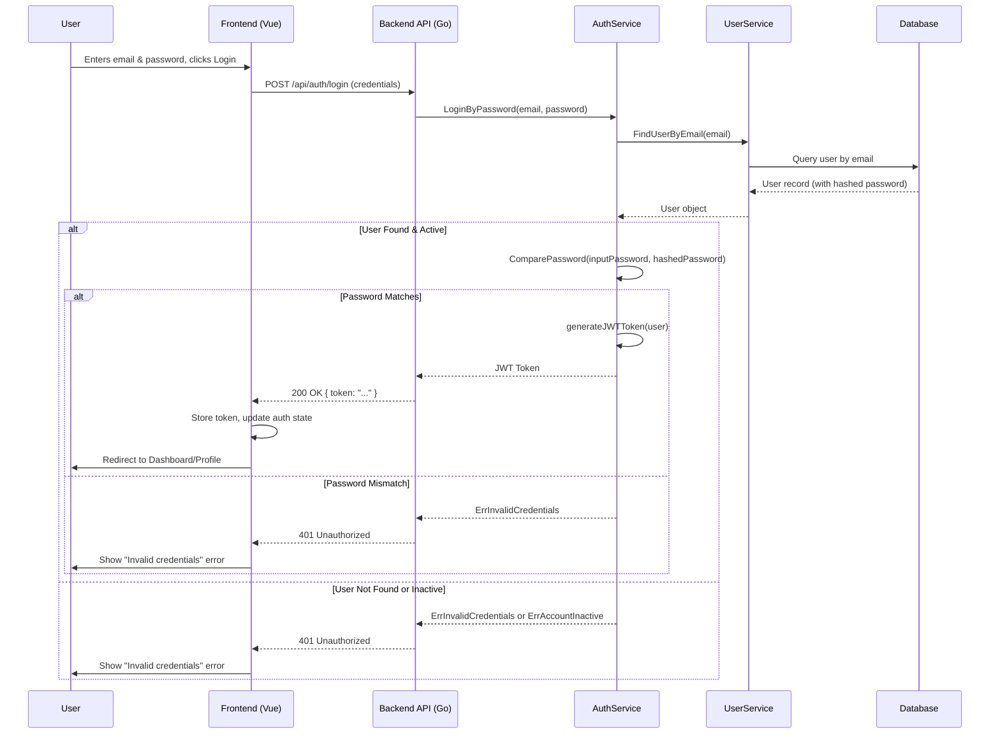
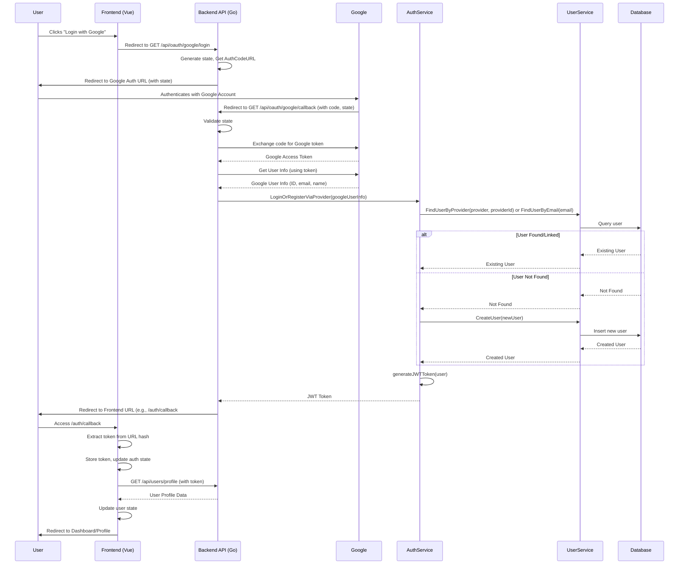

# Authentication Implementation Plan (`auth_plan.md`)

This plan outlines the steps to implement a robust authentication system for the Libero application, covering both backend (Go) and frontend (Vue.js) components, including standard credentials and OAuth (Google, Facebook, GitHub).

**Goals:**

1.  **Backend:** Refactor and solidify the authentication logic within the Go backend, ensuring clear separation of concerns and secure practices.
2.  **Frontend:** Implement user-facing login, registration, and OAuth flows in the Vue.js application.
3.  **Integration:** Ensure seamless communication and state management between the frontend and backend.

### 1. Backend Refinements (Go - `libero-backend`)

#### 1.1. Consolidate Authentication Logic in `AuthService`

*   **Action:** Move the password comparison and JWT generation logic currently invoked by `UserController.Login` into `AuthService.LoginByPassword`.
*   **Details:**
    *   `AuthService.LoginByPassword` will take email and password.
    *   It will call `UserService.FindUserByEmail` to retrieve the user.
    *   It will perform password comparison using `user.ComparePassword`.
    *   It will check if the user account is active (`user.Active`).
    *   If successful, it will generate and return the JWT using `authService.generateJWTToken`.
    *   Return appropriate errors (`ErrInvalidCredentials`, `ErrAccountInactive`, etc.).
*   **File:** `internal/service/auth_service.go`

#### 1.2. Refactor `UserController` for Login

*   **Action:** Modify `UserController.Login` to call the refactored `AuthService.LoginByPassword`.
*   **Details:**
    *   Inject `AuthService` into `UserController`.
    *   `UserController.Login` will parse credentials and call `authService.LoginByPassword`.
    *   Handle errors returned from `AuthService` and map them to appropriate HTTP status codes (e.g., `ErrInvalidCredentials` -> 401 Unauthorized).
*   **File:** `internal/api/controllers/user_controller.go`

#### 1.3. Enhance Error Handling & Logging

*   **Action:** Replace placeholder error checks and `fmt.Println` with proper error type checking (using `errors.Is`, `errors.As`) and structured logging (e.g., using a library like `logrus` or `zap`).
*   **Details:**
    *   Check for specific database errors (e.g., `gorm.ErrRecordNotFound`) in services/repositories.
    *   Define custom error types or use sentinel errors consistently.
    *   Implement a logging middleware or integrate logging within handlers/services.
*   **Files:** Affects most `service`, `controller`, and potentially `repository` files.

#### 1.4. Secure Configuration

*   **Action:** Ensure sensitive configurations (JWT Secret, OAuth Client IDs/Secrets, Database credentials) are loaded securely, preferably from environment variables or a dedicated secrets management system, not hardcoded.
*   **Details:**
    *   Verify that the `config` package loads values from the environment.
    *   Add checks on startup to ensure critical secrets are present.
    *   Update `.gitignore` to ensure no credential files are committed.
*   **Files:** `config/config.go`, potentially deployment scripts or environment setup.

#### 1.5. Define API Routes

*   **Action:** Ensure all necessary authentication and user routes are clearly defined and protected appropriately.
*   **Details:**
    *   **Public Routes:**
        *   `POST /api/auth/register` (`UserController.Register`)
        *   `POST /api/auth/login` (`UserController.Login`)
        *   `GET /api/oauth/{provider}/login` (e.g., `/api/oauth/google/login`) (`OAuthController.ProviderLogin`)
        *   `GET /api/oauth/{provider}/callback` (e.g., `/api/oauth/google/callback`) (`OAuthController.ProviderCallback`)
    *   **Protected Routes (using `AuthMiddleware`):**
        *   `GET /api/users/profile` (`UserController.GetProfile`)
        *   `PUT /api/users/profile` (`UserController.UpdateProfile`)
        *   Potentially other user routes (`GET /api/users`, `GET /api/users/{id}`, etc.) might require admin roles (`RoleMiddleware`).
*   **File:** `internal/api/routes/routes.go`

### 2. Frontend Implementation (Vue.js - `libero-frontend`)

#### 2.1. API Service Utility

*   **Action:** Create a utility/service (e.g., `src/services/api.js` or using `axios`) to handle communication with the backend API.
*   **Details:**
    *   Configure base URL.
    *   Implement functions for specific endpoints (login, register, getProfile, OAuth URLs).
    *   Set up request interceptors to automatically attach the JWT (Bearer token) from storage to authenticated requests.
    *   Set up response interceptors for centralized error handling (e.g., redirecting to login on 401 errors).

#### 2.2. Authentication State Management (Pinia/Vuex/Composition API)

*   **Action:** Implement a store or use the Composition API to manage authentication state globally.
*   **Details:**
    *   State variables: `isAuthenticated` (boolean), `user` (object or null), `token` (string or null), `status` (e.g., 'loading', 'success', 'error').
    *   Actions/Mutations: `login`, `register`, `logout`, `fetchProfile`, `handleOAuthCallback`.
    *   Getters/Computed Props: `isAuthenticated`, `currentUser`.
    *   Persist token to `localStorage` or `sessionStorage` upon successful login/OAuth.
    *   Initialize state from storage on application load.

#### 2.3. Vue Router Setup

*   **Action:** Configure Vue Router to define public and protected routes.
*   **Details:**
    *   Public routes: `/login`, `/register`.
    *   Protected routes: `/dashboard`, `/profile`, etc.
    *   Implement navigation guards (`router.beforeEach`) that check the authentication state (from the store) before allowing access to protected routes. Redirect unauthenticated users to `/login`.
    *   Add a route like `/auth/callback` to handle the redirect from the backend after OAuth.

#### 2.4. UI Components

*   **Action:** Create Vue components for authentication views.
*   **Details:**
    *   `Login.vue`: Form with email/password fields, submit button, links to register and OAuth providers. Calls the `login` action from the store.
    *   `Register.vue`: Form with username, email, password fields, submit button. Calls the `register` action.
    *   `OAuthButtons.vue` (optional): Component displaying buttons for Google, Facebook, GitHub login. Clicking a button redirects the user to the corresponding backend URL (`/api/oauth/{provider}/login`).
    *   `AuthCallback.vue`: Component for the `/auth/callback` route. Handles extracting the token from the URL hash/query, storing it, fetching the profile, and redirecting.

#### 2.5. OAuth Flow Handling (Frontend)

*   **Refined Flow:**
    1.  User clicks OAuth button -> Redirect to `GET /api/oauth/{provider}/login`.
    2.  Backend redirects to OAuth provider.
    3.  User authenticates with provider.
    4.  Provider redirects to `GET /api/oauth/{provider}/callback`.
    5.  Backend handles callback, gets/creates user, generates JWT.
    6.  Backend redirects to frontend `https://your-frontend.com/auth/callback#token=JWT_TOKEN_HERE`.
    7.  Frontend (`AuthCallback.vue`) extracts token from hash, stores it, fetches profile, redirects to dashboard.
*   **Action:** Implement the `AuthCallback.vue` component and the logic within the auth store to handle this flow.

#### 2.6. Form Validation

*   **Action:** Add client-side validation to Login and Register forms.
*   **Details:** Use a library like `Vuelidate` or built-in Vue 3 validation.

### 3. Diagrams

#### 3.1. Password Login Sequence Diagram

#### 3.2. OAuth Login Sequence Diagram (Example: Google)

---