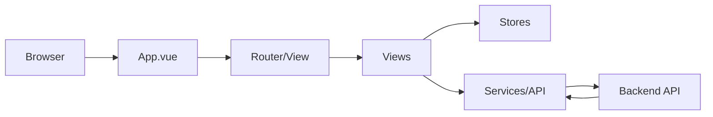

# Libero Frontend (Vue 3 + TypeScript + Vite + Pinia)

This module implements the web UI for the Libero AI Project, providing a responsive, single-page application with user authentication, data visualization, and interactive forms.

## Tech Stack
- Vue 3 Composition API
- Vite as build tool
- TypeScript for static typing
- Pinia for state management
- Vue Router for SPA routing
- Axios for HTTP requests
- Vee-Validate & Yup for form validation
- Tailwind CSS for utility-first styling

## Directory Structure
```
libero-frontend/
├── public/               # Static assets (images, icons, favicon)
├── src/
│   ├── components/       # Reusable UI components (Navbar, Footer, Cards)
│   ├── router/           # Route definitions and guards
│   ├── stores/           # Pinia stores (auth, profile, fixtures)
│   ├── services/         # API client and service functions (axios)
│   ├── views/            # Page-level views (Home, Leagues, Profile, Login)
│   ├── auth/             # Auth-related components and pages
│   ├── home/             # Home page modules (dashboard, summaries)
│   ├── leagues/          # League and fixtures pages/components
│   └── main.ts           # Application bootstrap (createApp)
├── vite.config.ts        # Vite configuration
├── tsconfig.json         # TypeScript settings
└── package.json          # NPM scripts & dependencies
```

## Getting Started
```bash
cd libero-frontend
pnpm install
pnpm dev
```
- Production build:
```bash
pnpm build
```

## Features
- **Authentication**: Email/password login, registration, OAuth (Google, Facebook, GitHub)
- **User Profile & Preferences**: Follow/unfollow teams, players, competitions
- **Fixtures Display**: Today's matches, upcoming matches, match results
- **Player & Team Details**: Detailed stats and history
- **Top Scorers**: Leaderboard per competition
- **Responsive Design**: Mobile-first layout with Tailwind CSS
- **Form Validation**: Vee-Validate & Yup for robust input handling

## Data Flow & Component Interaction
1. **App Initialization** (`main.ts`): Installs Pinia and Router, mounts `App.vue`.
2. **Layout** (`App.vue`): Renders `Navbar`, `<router-view/>`, and `Footer`.
3. **Auth Store**: `useAuthStore.initializeAuth()` loads token and user profile.
4. **Routing**: `router/index.ts` defines public and protected routes with lazy-loaded views.
5. **Views**: Fetch data via `services/api.ts`; update Pinia stores or local state.
6. **API Layer**: Axios client configured with interceptors for JWT and error handling.
7. **Backend Communication**: HTTP requests to Go API return JSON, used by stores and components.



## Coding Style & Conventions
- Use `<script setup lang="ts">` with Composition API in `.vue` files.
- Name components and files in PascalCase (e.g., `UserCard.vue`).
- Centralize API calls in `src/services/api.ts`; use Axios interceptors for auth token and error handling.
- Manage state globally with Pinia; define actions, getters, and separate stores per feature.
- Import modules using `@/` alias for cleaner paths.
- Apply Tailwind CSS utility classes; extract reusable styles via `@apply` in CSS.
- Enforce linting and formatting with ESLint and Prettier (recommended setup).

## Further Reading
For detailed API endpoints and request/response examples, refer to the Go backend documentation in `libero-backend/README.md`.
