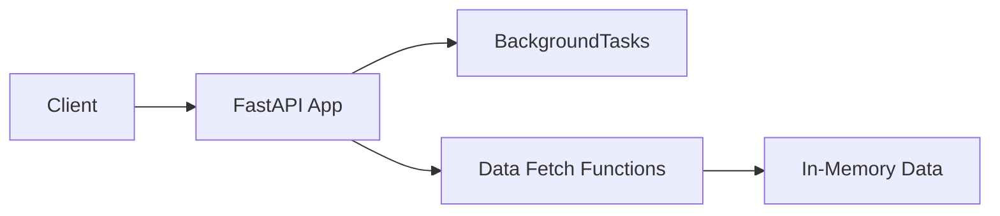

# Libero ML - Data Scraping Microservice

This microservice is responsible for scraping sports data (standings, results, player stats, etc.) based on user preferences stored in the main Libero application.

## Setup

1.  **Create a Virtual Environment:**
    ```bash
    python -m venv venv
    ```
    *   On Windows (cmd/powershell):
        ```powershell
        .\venv\Scripts\activate
        ```
    *   On macOS/Linux (bash/zsh):
        ```bash
        source venv/bin/activate
        ```

2.  **Install Dependencies:**
    ```bash
    pip install -r requirements.txt
    ```

## Running the Service (Development)

Use `uvicorn` to run the FastAPI application. The `--reload` flag enables auto-reloading when code changes are detected.

```bash
uvicorn main:app --reload --port 8001
```

The API will be available at `http://127.0.0.1:8001`. You can access the interactive API documentation (Swagger UI) at `http://127.0.0.1:8001/docs`.

## Endpoints

*   `GET /status`: Returns the current status of the scraper.
*   `POST /scrape`: Triggers a background scraping task.

## Features
- **Scraper Control**: Monitor and trigger background scraping via `/status` (GET) and `/scrape` (POST).
- **Sports Data API**: Serve upcoming matches (`/matches/upcoming`), match results (`/matches/results`), and player statistics (`/players/{player_id}/stats`).
- **Data Validation & Docs**: Pydantic models for request/response schemas with automatic Swagger UI generation.

## Architecture & Data Flow
1. **App Initialization**: FastAPI app configured in `main.py`, setting title, description, and version.
2. **Route Definitions**: Endpoints defined with decorators (`@app.get`, `@app.post`) and grouped by tags.
3. **Background Task**: `/scrape` uses FastAPI `BackgroundTasks` to asynchronously run `trigger_scrape_background`, updating `scraper_status`.
4. **Placeholder Data**: In-memory lists (`_upcoming_matches_db`, `_results_db`, `_player_stats_db`) simulate data sources.
5. **Data Fetching**: `fetch_upcoming_matches`, `fetch_results`, and `fetch_player_stats` functions return placeholder data, later to be replaced with real scraping or DB logic.
6. **Response Modeling**: Endpoints return Pydantic models (`Match`, `Result`, `PlayerStats`) ensuring consistent JSON output.



## Coding Style & Conventions
- **FastAPI & Pydantic**: Leverage decorators and BaseModel classes for clear, type-safe APIs.
- **Type Hints**: Use Python typing (`Optional`, `List`) for function parameters and return types.
- **Logging**: Replace `print` statements with `logging` module for configurable log levels.
- **Configuration**: Load settings from environment variables (`python-dotenv` or `pydantic.BaseSettings`).
- **Project Structure**: For scaling, split `main.py` into `routers/`, `services/`, `models/`, and `tests/` packages.
- **Testing**: Write unit tests with `pytest` and `httpx` for endpoint validation.

## TODO

*   Implement database connection to read preferences from the main application's DB.
*   Implement actual web scraping logic.
*   Implement data storage for scraped results (likely a separate DB).
*   Implement scheduling (e.g., using APScheduler).
*   Add proper configuration management (e.g., environment variables).
*   Add authentication/security for endpoints if necessary.