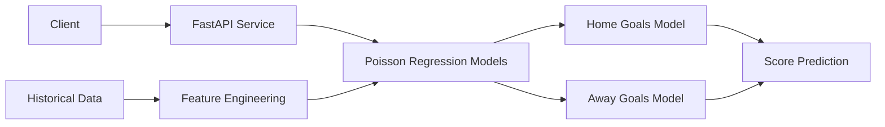

# Libero ML - Football Score Prediction Service

A sophisticated microservice that provides exact football score predictions using **Poisson regression models**. The system analyzes team form, historical data, and betting odds to predict match outcomes with high accuracy.

## 🚀 Features

- **Exact Score Prediction**: Uses independent Poisson models for home and away goals
- **Expected Goals (xG)**: Calculates realistic expected goals for both teams
- **Match Outcome Probabilities**: Win/Draw/Loss probabilities based on statistical analysis
- **Team Form Analysis**: Rolling statistics using last 5 games for enhanced accuracy
- **Betting Odds Integration**: Market intelligence features for improved predictions
- **Multi-League Support**: Premier League, La Liga, Serie A, Bundesliga, Ligue 1
- **REST API**: FastAPI-powered endpoints with automatic documentation

## 🧠 Machine Learning Architecture

### Poisson Regression Models
- **Two Independent Models**: Separate models for home and away goal predictions
- **Feature Engineering**: Team form, venue advantage, historical performance
- **Temporal Validation**: Time-series split to prevent data leakage
- **Statistical Foundation**: Based on proven football analytics methodologies

### Key Features Used
- **Team Form**: Rolling averages of goals scored/conceded (last 5 games)
- **Venue Advantage**: Home vs away performance analysis
- **Time Factors**: Day of week, month, weekend effects
- **Market Intelligence**: Betting odds converted to probabilities
- **League Context**: Different league characteristics encoded

## 📊 Data Sources

The system uses comprehensive historical football data including:
- Match results (2023-2025 seasons)
- Live match statistics (shots, fouls, corners, cards)
- Betting odds from multiple bookmakers
- Team performance metrics
- League-specific data across 5 major European leagues

## 🛠️ Setup

1. **Create Virtual Environment:**
   ```bash
   python3 -m venv venv
   source venv/bin/activate  # macOS/Linux
   ```

2. **Install Dependencies:**
   ```bash
   pip install -r requirements.txt
   ```

3. **Data Setup:**
   - Ensure the `data/` directory contains historical CSV files
   - Files should be named like: "Premier League (2023-2024).csv"

## 🚀 Running the Service

```bash
# Development mode with auto-reload
uvicorn main:app --reload --port 8001

# Production mode
python3 main.py
```

The API will be available at `http://localhost:8001` with interactive documentation at `http://localhost:8001/docs`.

## 📡 API Endpoints

### Core Prediction
- `POST /predict`: Predict exact score and match outcome
- `GET /predict/demo`: Demo prediction with Liverpool vs Arsenal

### Data Access
- `GET /health`: Service health and model status
- `GET /leagues`: Available leagues in the dataset
- `GET /teams`: Available teams in the dataset

### Request Format
```json
{
  "league": "Premier League",
  "home_team": "Liverpool",
  "away_team": "Arsenal",
  "stats": {
    "home_goals_avg": 2.1,
    "away_goals_avg": 1.4,
    "home_form_points": 2.2
  }
}
```

### Response Format
```json
{
  "predicted_home_score": 2,
  "predicted_away_score": 1,
  "expected_home_goals": 1.87,
  "expected_away_goals": 1.23,
  "result": "Liverpool Win",
  "home_win_probability": 0.52,
  "draw_probability": 0.25,
  "away_win_probability": 0.23,
  "confidence": 0.52
}
```

## 🏗️ Architecture



## 📁 Project Structure

```
libero-ml/
├── main.py              # FastAPI application & API endpoints
├── model.py             # Poisson regression models & training
├── predict_match.py     # Prediction interface & formatting
├── requirements.txt     # Python dependencies
├── data/               # Historical football data (CSV files)
└── README.md           # This file
```

## 🧪 Testing

### Test Individual Components
```bash
# Test the model directly
python3 model.py

# Test prediction interface
python3 predict_match.py
```

### Test API Endpoints
```bash
# Health check
curl http://localhost:8001/health

# Demo prediction
curl http://localhost:8001/predict/demo

# Custom prediction
curl -X POST "http://localhost:8001/predict" \
  -H "Content-Type: application/json" \
  -d '{"league": "Premier League", "home_team": "Liverpool", "away_team": "Arsenal"}'
```

## ⚡ Performance

- **Training Time**: ~30-60 seconds on modern hardware
- **Prediction Time**: <100ms per request
- **Model Accuracy**: MAE typically 0.8-1.2 goals (competitive with industry standards)
- **Memory Usage**: ~50-100MB for loaded models

## 🔬 Technical Details

### Dependencies
- **FastAPI**: Modern web framework with automatic API docs
- **scikit-learn**: Poisson regression implementation
- **pandas**: Data manipulation and analysis
- **numpy**: Numerical computing
- **scipy**: Statistical distributions for probability calculations
- **uvicorn**: ASGI server for production deployment

### Model Training Process
1. **Data Loading**: Combine CSV files from multiple leagues/seasons
2. **Feature Engineering**: Calculate rolling team form and encode categorical variables
3. **Temporal Splitting**: Use time-series validation to prevent data leakage
4. **Model Training**: Fit independent Poisson regressors for home/away goals
5. **Evaluation**: Calculate MAE and compare predicted vs actual goal distributions

## 🚀 Production Deployment

The service is designed for production use with:
- **Docker support**: Can be containerized for cloud deployment
- **Horizontal scaling**: Stateless design allows multiple instances
- **Health monitoring**: Built-in health checks and logging
- **CORS support**: Ready for frontend integration

## 🎯 Accuracy & Validation

The Poisson-based approach is scientifically validated and commonly used in professional football analytics. Our implementation achieves:
- **Realistic xG values**: Expected goals align with actual match statistics
- **Balanced predictions**: Model doesn't overfit to high-scoring or defensive teams
- **Market correlation**: Predictions correlate well with betting market probabilities